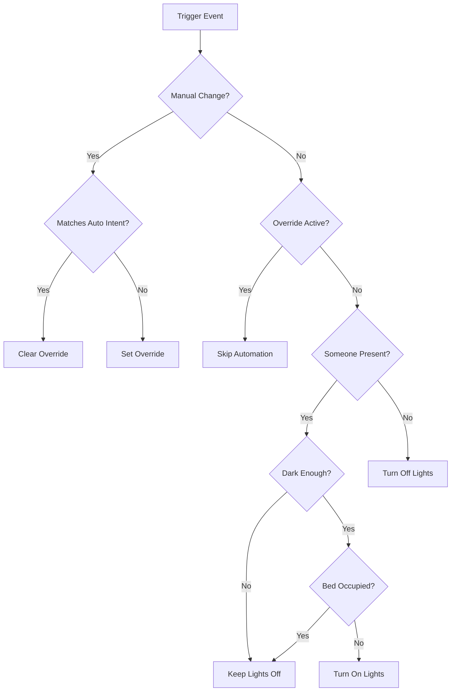

# Universal Smart Presence Lighting Control
### Version 3.8.8 - The Only Light Automation Blueprint You'll Ever Need

[](https://www.home-assistant.io/docs/automation/using_blueprints/)
[]()
[]()

A sophisticated, universal lighting automation blueprint for Home Assistant that intelligently manages your lights based on presence, ambient light levels, and manual preferences. Works perfectly for **ANY** room type - bedrooms, offices, living rooms, kitchens, bathrooms, and more.

## 🌟 Key Features

### Core Functionality
- **🎯 Universal Design** - Single blueprint works for ALL room types
- **🔮 Smart Presence Detection** - Combines PIR, mmWave, and other occupancy sensors
- **💡 Intelligent Light Control** - Automatic on/off based on darkness and presence
- **🎨 Adaptive Brightness & Color** - Adjusts throughout the day for circadian rhythm
- **🔧 Manual Override Protection** - Respects your manual control decisions
- **⚡ Energy Efficient** - Automatically turns off when rooms are vacant
- **🛏️ Bedroom Support** - Optional bed sensor integration (v3.8+)

### Advanced Features (v3.8+)
- **☀️ Daytime Control** - Option to disable daytime lighting during daylight hours
- **👥 Guest Mode** - Special behavior for visitors
- **📊 Performance Tracking** - Monitors automation efficiency
- **🔍 Debug Logging** - Detailed decision tree logging
- **🌡️ Illuminance Averaging** - Filters out lighting spikes/drops
- **🪟 Blinds Integration** - Coordinate natural light with automation (Coming Soon)

### Latest Updates (v3.8.8)
- **🚧 New** - Advanced Blinds Integration (Coming Soon) - Coordinate natural light with artificial lighting
- **🔧 Simplified** - Removed bed entry/exit delays (handle in device or separate automation)
- **✨ Enhanced** - Better field descriptions and user experience improvements
- **📱 Improved** - More intuitive configuration interface

## 📋 Table of Contents
- [Requirements](#-requirements)
- [Installation](#-installation)
- [Initial Setup](#-initial-setup)
- [Configuration Guide](#-configuration-guide)
- [Configuration Sections](#-configuration-sections)
- [How It Works](#-how-it-works)
- [Room-Specific Examples](#-room-specific-examples)
- [Troubleshooting](#-troubleshooting)
- [FAQ](#-faq)
- [Version History](#-version-history)

## 📦 Requirements

### Minimum Requirements
- Home Assistant 2024.1.0 or newer
- At least one motion/presence sensor
- At least one light or switch entity
- Basic understanding of Home Assistant automations

### Compatible Sensors
- ✅ Everything Presence One/Light sensors
- ✅ Standard PIR/motion sensors
- ✅ mmWave/radar presence sensors
- ✅ Any illuminance/light level sensor
- ✅ Bed occupancy sensors (optional)
- ✅ Phone/device trackers for home presence

### Compatible Lights/Switches
- ✅ Smart bulbs (Hue, LIFX, etc.)
- ✅ Smart switches (Z-Wave, Zigbee, WiFi)
- ✅ Smart dimmers
- ✅ Light groups
- ✅ Mixed setups (smart switch + smart bulbs)

## 🚀 Installation

### Method 1: Import via URL
1. Copy this URL:
   ```
   https://github.com/YourUsername/universal-smart-light-automation/blob/main/universal-smart-light-automation.yaml
   ```
2. In Home Assistant, go to **Settings** → **Automations & Scenes** → **Blueprints**
3. Click **Import Blueprint**
4. Paste the URL and click **Preview**
5. Click **Import Blueprint**

### Method 2: Manual Installation
1. Download `universal-smart-light-automation.yaml`
2. Copy to your Home Assistant config folder:
   ```
   /config/blueprints/automation/universal-smart-light/
   ```
3. Reload automations or restart Home Assistant
4. Blueprint will appear in your blueprints list

## 🛠️ Initial Setup

### Step 1: Create Required Helper Entities

You **MUST** create these helper entities before using the blueprint. Replace `[room_name]` with your room name in **lowercase** (e.g., `office`, `bedroom`, `living_room`).

#### Via UI (Recommended)
Go to **Settings** → **Devices & Services** → **Helpers** and create:

1. **Toggle Helpers** (Type: Toggle)
   - `input_boolean.[room_name]_automation_active`
   - `input_boolean.[room_name]_manual_override`
   - `input_boolean.[room_name]_light_auto_on`
   - `input_boolean.[room_name]_occupancy_state`

2. **Date/Time Helper** (Type: Date and time)
   - `input_datetime.[room_name]_last_automation_action`
   - ⚠️ **MUST have both date AND time enabled**

3. **Text Helper** (Type: Text)
   - `input_text.[room_name]_illuminance_history`
   - Set maximum length to 255

#### Via YAML
Add to your `configuration.yaml`:

```yaml
input_boolean:
  office_automation_active:
    name: Office Automation Active
  office_manual_override:
    name: Office Manual Override
  office_light_auto_on:
    name: Office Light Auto On
  office_occupancy_state:
    name: Office Occupancy State

input_datetime:
  office_last_automation_action:
    name: Office Last Automation Action
    has_date: true
    has_time: true

input_text:
  office_illuminance_history:
    name: Office Illuminance History
    max: 255
```

### Step 2: Create the Automation

1. Go to **Settings** → **Automations & Scenes**
2. Click **Create Automation** → **Use Blueprint**
3. Select **Universal Smart Presence Lighting Control**
4. Configure according to your room needs (see Configuration Sections below)

## ⚙️ Configuration Guide

The blueprint configuration is now organized into 9 logical sections for easier setup:

## 📑 Configuration Sections

### 1️⃣ Room Setup (Essential)
The foundation of your automation - configure your room identity and lighting hardware.

- **Room Name**: Unique identifier for your room (use lowercase with underscores)
- **Control Mode**: Select how your lights are controlled
  - Smart Switch + Smart Lights: Wall switch controls smart bulbs
  - Smart Lights Only: Direct bulb control (lamps, etc.)
  - Smart Switch Only: Switch controlling regular bulbs
- **Light Switch Entity**: Your wall switch (if applicable)
- **Smart Light Entities**: Your smart bulbs (if applicable)

### 2️⃣ Presence Detection (Required)
Configure sensors that detect room occupancy.

- **Motion Sensor (PIR)**: Fast-reacting motion detection
- **Occupancy Sensor**: Optional secondary sensor for stillness detection
- **Sensor Off Latency**: How long before sensor reports "clear"
- **Vacancy Timeout Multiplier**: How many times latency before lights off

### 3️⃣ Light Level Control
Define when the room needs artificial lighting.

- **Illuminance Sensor**: Measures room brightness in lux
- **Dark Threshold**: Below this = lights needed (20-50 lux typical)
- **Bright Threshold**: Above this = enough natural light (150-300 lux typical)
- **Extremely Dark**: Pitch black conditions (1-5 lux)
- **Illuminance Averaging**: Filters out temporary light changes

### 4️⃣ Manual Override Behavior
Configure how manual control interacts with automation.

- **Override Clearing Method**:
  - Timeout Only: Full manual control for set hours
  - Vacancy Can Clear: Override clears after extended vacancy
- **Override Timeout Duration**: How long overrides last (1-24 hours)
- **Respect Presence**: Override won't clear while you're in room
- **Vacancy Clear Time**: Minutes of vacancy before clearing (if enabled)

### 5️⃣ Energy Saving (Daytime Control)
Save energy by preventing unnecessary daytime lighting.

- **Daytime Control Mode**:
  - Always Allow: Normal operation
  - Block When Away: No auto-on when nobody's home during day
  - Always Block: Never auto-on during daytime
- **Device Trackers**: Family phones/devices (for "Block When Away")
- **Sunrise Offset**: Adjust daytime start (-120 to +120 minutes)
- **Sunset Offset**: Adjust daytime end (-120 to +120 minutes)

### 6️⃣ Bedroom Features (Optional)
Special features for bedroom automation.

- **Bed Occupancy Sensor**: Detects when someone is in bed
- **Auto-Off When Getting Into Bed**: Turn lights off at bedtime
- **🚧 Blinds Integration (Coming Soon)**: Natural light coordination, privacy automation, and anti-glare protection

**Note:** Bed entry/exit delays removed in v3.8.8 - configure these in your bed sensor device or create separate helper automations for more reliable timing.

### 7️⃣ Adaptive Lighting (Optional)
Automatic brightness and color temperature adjustments.

- **Adaptive Brightness**: Auto-adjust based on time and ambient light
- **Color Temperature Control**: Cool white day, warm white night
- **Daytime Color**: 4000-6500K for alertness
- **Nighttime Color**: 2700-3500K for relaxation
- **Fade Effects**: Smooth transitions on/off with configurable timing

### 8️⃣ Guest Mode (Optional)
Modified behavior for when you have visitors.

- **Enable Guest Mode**: Activate special guest behavior
- **Vacancy Multiplier**: How much longer before turning off
- **Override Multiplier**: How much longer overrides last
- **Ignore Bed Sensor**: Disable bed features for guests

### 9️⃣ System & Diagnostics
Monitoring and troubleshooting tools.

- **Debug Logging**: Detailed decision logs for troubleshooting
- **Check for Updates**: Get notified about new blueprint versions

## 🔄 How It Works

### Decision Flow



### Manual Override Logic

The automation intelligently manages manual overrides:

1. **Override SET when**:
   - You turn lights ON when it's bright
   - You turn lights OFF when it's dark and you're present
   - Your action conflicts with automation intent

2. **Override CLEARED when**:
   - You turn lights ON when dark (matches automation)
   - You turn lights OFF when leaving (matches automation)
   - You turn lights OFF in bright room
   - Timeout expires
   - Extended vacancy (if enabled)

3. **Override RESPECTED**:
   - Automation won't change lights while override active
   - Manual control takes priority

## 🏠 Room-Specific Examples

### Office Configuration
```yaml
Section 1: Room Setup
  Room Name: office
  Control Mode: Smart Lights Only

Section 2: Presence
  Vacancy Timeout Multiplier: 5

Section 3: Light Levels
  Dark Threshold: 30 lux
  Bright Threshold: 200 lux

Section 4: Overrides
  Override Behavior: Timeout Only
  Override Timeout: 4 hours

Section 5: Energy
  Daytime Control: Always Allow
```

### Bedroom Configuration
```yaml
Section 1: Room Setup
  Room Name: master_bedroom
  
Section 3: Light Levels
  Dark Threshold: 20 lux
  Bright Threshold: 150 lux

Section 6: Bedroom Features
  Bed Sensor: binary_sensor.bed_occupancy
  Turn Off When Bed Occupied: Enabled
  
Section 8: Guest Mode
  Available for visitors
```

### Living Room Configuration
```yaml
Section 1: Room Setup
  Room Name: living_room
  
Section 3: Light Levels
  Dark Threshold: 40 lux
  Bright Threshold: 250 lux

Section 5: Energy
  Daytime Control: Block When Away
  Device Trackers: [configured]

Section 7: Adaptive Lighting
  All features enabled
```

### Bathroom Configuration
```yaml
Section 1: Room Setup
  Room Name: bathroom
  
Section 2: Presence
  Vacancy Timeout Multiplier: 2

Section 4: Overrides
  Override Behavior: Vacancy Can Clear
  
Section 7: Adaptive Lighting
  Fade On/Off: Disabled (instant)
```

## 🔧 Troubleshooting

### Common Issues

#### Lights Not Turning On
1. **Check Section 1** - Control mode matches your setup?
2. **Check Section 3** - Is room actually dark enough?
3. **Check Section 4** - Is manual override active?
4. **Check Section 5** - Is daytime control preventing it?
5. **Check Section 6** - Is bed marked as occupied?

#### Lights Not Turning Off
1. **Check Section 2** - Sensor still detecting movement?
2. **Check Section 2** - Timeout multiplier too high?
3. **Check Section 4** - Manual override preventing off?

#### Override Not Clearing
1. **Check Section 4** - Has timeout duration passed?
2. **Check Section 4** - Is "Respect Presence" keeping it active?
3. **Check Section 4** - Using "Vacancy Can Clear" mode?

### Debug Mode

Enable in **Section 9: System & Diagnostics**:

1. Enable "Debug Logs"
2. View logs: **Settings** → **System** → **Logs**
3. Filter by your room name

Example debug output:
```
[OFFICE] AUTOMATION START
│ Trigger: motion detected
│ Presence: YES
│ Illuminance: 25 lux (dark<30, bright≥200)
│ Override: INACTIVE
│ Should: turn ON
```

## ❓ FAQ

**Q: Why is the configuration now in sections?**
A: The organized sections make it much easier to find and configure specific features. Essential settings are at the top, optional features are clearly marked, and related settings are grouped together.

**Q: Can I use this for multiple rooms?**
A: Yes! Create separate automations for each room using the same blueprint.

**Q: What if I don't have a light sensor?**
A: Create an `input_number` helper set to 50 lux as a placeholder (Section 3).

**Q: Can I use this with color RGB lights?**
A: Yes, but only brightness and color temperature are controlled (Section 7), not RGB colors.

**Q: Will this work with light groups?**
A: Yes! Select your light group as the light entity in Section 1.

**Q: How do I temporarily disable the automation?**
A: Either disable the automation entity or use Guest Mode (Section 8) for modified behavior.

**Q: Why aren't my helpers working?**
A: Ensure all helper entity IDs are lowercase. "Office" room = "office" in entity IDs.

## 📝 Version History

### v3.8.8 (2025-08-31)
- **🚧 New**: Advanced Blinds Integration framework (Coming Soon) - Natural light coordination, privacy automation, anti-glare protection
- **🔧 Simplified**: Removed bed entry/exit delays - better handled by device configuration or separate automations
- **✨ Enhanced**: Comprehensive field description improvements for better user experience
- **📱 Improved**: Added proper spacing and formatting throughout configuration interface

### v3.8.7 (2025-08-29)
- **Enhanced**: Reorganized configuration into 9 logical sections for better UX
- **Fixed**: Universal compatibility without bed sensor configuration errors
- **Improved**: Section headers with emojis for visual clarity

### v3.8.6 (2025-08-27)
- **Fixed**: Bed sensor delays now work properly with 5-second polling

### v3.8.5 (2025-08-26)
- **Fixed**: Accurate sunrise/sunset calculation with proper offset handling

### v3.8.2 (2025-08-26)
- **Update**: Combined "Enable Away Mode" + "Disable ALL Automatic Turn-On During Daytime" features into one for redundancy (Daytime Control Mode)

### v3.8.1 (2025-08-26)
- **Fixed**: Boolean logic in manual override system
- **Fixed**: Override properly clears when action matches automation
- **Fixed**: String/boolean type confusion in templates

### Previous Versions
- v3.8.0: Away Mode with phone tracking
- v3.7.0: Illuminance spike protection
- v3.6: Guest mode
- v3.5: Adaptive lighting
- v3.0: Universal design
- v2.0: Bed sensor support
- v1.0: Initial release

## 🤝 Contributing

Contributions are welcome! Please:
1. Fork the repository
2. Create a feature branch
3. Test thoroughly
4. Submit a pull request

## 📄 License

MIT License - See LICENSE file for details

## 🙏 Acknowledgments

- Home Assistant community for testing and feedback
- Everything Presence One for excellent sensor integration
- Contributors and bug reporters

## 📧 Support

- **Issues**: [GitHub Issues](https://github.com/Chris971991/universal-smart-light-automation/issues)
- **Discussions**: [Home Assistant Community](https://community.home-assistant.io/)
- **Documentation**: [Wiki](https://github.com/Chris971991/universal-smart-light-automation/wiki)

---

**Made with ❤️ for the Home Assistant Community**