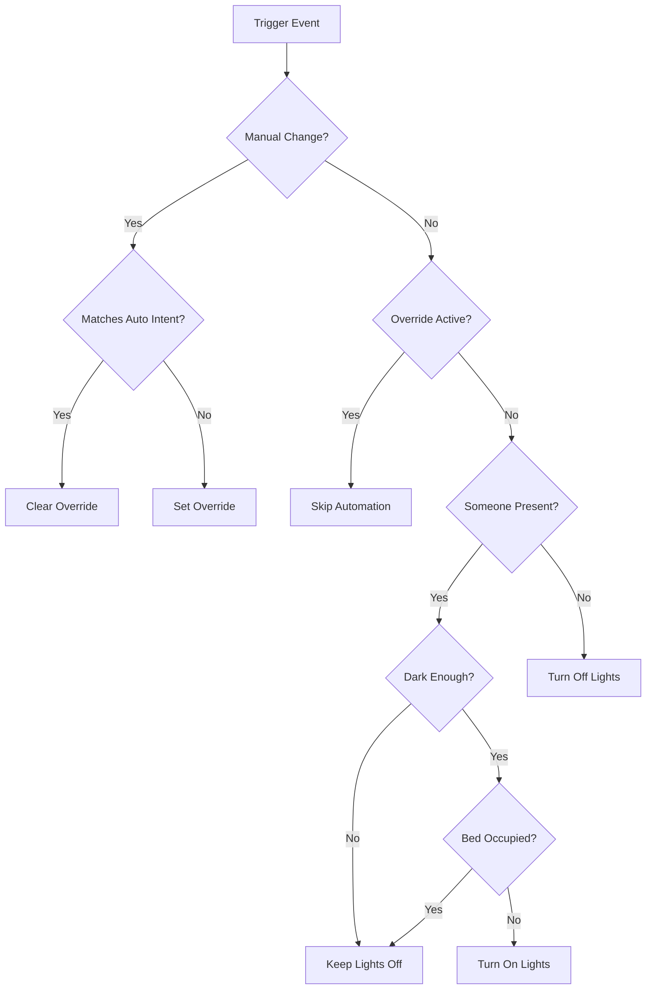

# Universal Smart Presence Lighting Control
### Enhanced Version 3.8.2 - The Only Light Automation Blueprint You'll Ever Need

[](https://www.home-assistant.io/docs/automation/using_blueprints/)
[]()
[]()

A sophisticated, universal lighting automation blueprint for Home Assistant that intelligently manages your lights based on presence, ambient light levels, and manual preferences. Works perfectly for **ANY** room type - bedrooms, offices, living rooms, kitchens, bathrooms, and more.

## 🌟 Key Features

### Core Functionality
- **🎯 Universal Design** - Single blueprint works for ALL room types
- **🔮 Smart Presence Detection** - Combines PIR, mmWave, and other occupancy sensors
- **💡 Intelligent Light Control** - Automatic on/off based on darkness and presence
- **🎨 Adaptive Brightness & Color** - Adjusts throughout the day for circadian rhythm
- **🔧 Manual Override Protection** - Respects your manual control decisions
- **⚡ Energy Efficient** - Automatically turns off when rooms are vacant
- **🛏️ Bedroom Support** - Optional bed sensor integration (v3.8+)

### Advanced Features (v3.8+)
- **🏠 Away Mode** - Prevents daytime lighting when nobody's home
- **☀️ Daytime Control** - Option to disable daytime lighting during daylight hours
- **👥 Guest Mode** - Special behavior for visitors
- **📊 Performance Tracking** - Monitors automation efficiency
- **🔍 Debug Logging** - Detailed decision tree logging
- **🌡️ Illuminance Averaging** - Filters out lighting spikes/drops

### Latest Updates (v3.8.2)
- **Enhanced** - Combined "Enable Away Mode" + "Disable ALL Automatic Turn-On During Daytime" features into one for redundancy (Daytime Control Mode)

## 📋 Table of Contents
- [Requirements](#-requirements)
- [Installation](#-installation)
- [Initial Setup](#-initial-setup)
- [Configuration Guide](#-configuration-guide)
- [How It Works](#-how-it-works)
- [Room-Specific Examples](#-room-specific-examples)
- [Troubleshooting](#-troubleshooting)
- [FAQ](#-faq)
- [Version History](#-version-history)

## 📦 Requirements

### Minimum Requirements
- Home Assistant 2024.1.0 or newer
- At least one motion/presence sensor
- At least one light or switch entity
- Basic understanding of Home Assistant automations

### Compatible Sensors
- ✅ Everything Presence One/Light sensors
- ✅ Standard PIR/motion sensors
- ✅ mmWave/radar presence sensors
- ✅ Any illuminance/light level sensor
- ✅ Bed occupancy sensors (optional)
- ✅ Phone/device trackers for home presence

### Compatible Lights/Switches
- ✅ Smart bulbs (Hue, LIFX, etc.)
- ✅ Smart switches (Z-Wave, Zigbee, WiFi)
- ✅ Smart dimmers
- ✅ Light groups
- ✅ Mixed setups (smart switch + smart bulbs)

## 🚀 Installation

### Method 1: Import via URL
1. Copy this URL:
   ```
   https://github.com/YourUsername/universal-smart-light-automation/blob/main/universal-smart-light-automation.yaml
   ```
2. In Home Assistant, go to **Settings** → **Automations & Scenes** → **Blueprints**
3. Click **Import Blueprint**
4. Paste the URL and click **Preview**
5. Click **Import Blueprint**

### Method 2: Manual Installation
1. Download `universal-smart-light-automation.yaml`
2. Copy to your Home Assistant config folder:
   ```
   /config/blueprints/automation/universal-smart-light/
   ```
3. Reload automations or restart Home Assistant
4. Blueprint will appear in your blueprints list

## 🛠️ Initial Setup

### Step 1: Create Required Helper Entities

You **MUST** create these helper entities before using the blueprint. Replace `[room_name]` with your room name in **lowercase** (e.g., `office`, `bedroom`, `living_room`).

#### Via UI (Recommended)
Go to **Settings** → **Devices & Services** → **Helpers** and create:

1. **Toggle Helpers** (Type: Toggle)
   - `input_boolean.[room_name]_automation_active`
   - `input_boolean.[room_name]_manual_override`
   - `input_boolean.[room_name]_light_auto_on`
   - `input_boolean.[room_name]_occupancy_state`

2. **Date/Time Helper** (Type: Date and time)
   - `input_datetime.[room_name]_last_automation_action`
   - ⚠️ **MUST have both date AND time enabled**

3. **Text Helper** (Type: Text)
   - `input_text.[room_name]_illuminance_history`
   - Set maximum length to 255

#### Via YAML
Add to your `configuration.yaml`:

```yaml
input_boolean:
  office_automation_active:
    name: Office Automation Active
  office_manual_override:
    name: Office Manual Override
  office_light_auto_on:
    name: Office Light Auto On
  office_occupancy_state:
    name: Office Occupancy State

input_datetime:
  office_last_automation_action:
    name: Office Last Automation Action
    has_date: true
    has_time: true

input_text:
  office_illuminance_history:
    name: Office Illuminance History
    max: 255
```

### Step 2: Create the Automation

1. Go to **Settings** → **Automations & Scenes**
2. Click **Create Automation** → **Use Blueprint**
3. Select **Universal Smart Presence Lighting Control**
4. Configure according to your room needs (see Configuration Guide below)

## ⚙️ Configuration Guide

### Basic Configuration

#### Room Name
- **What it is**: Identifier for your room
- **Example**: `office`, `master_bedroom`, `living_room`
- **Important**: Use lowercase with underscores for multi-word names

#### Presence Sensors
- **PIR Motion Sensor**: Fast-reacting motion detection
- **Occupancy Sensor**: (Optional) Secondary sensor for stillness detection
- **Tip**: Can use same sensor for both if you only have one

#### Light/Switch Configuration
Choose your setup:
- **Smart Switch Only**: Controls regular bulbs
- **Smart Lights Only**: Direct bulb control (lamps, etc.)
- **Smart Switch + Smart Lights**: Switch acts as controller

#### Illuminance Thresholds
- **Dark Threshold**: Below this = needs lights (typically 20-50 lux)
- **Bright Threshold**: Above this = enough natural light (typically 150-300 lux)
- **Extremely Dark**: Pitch black conditions (typically 1-5 lux)

### Advanced Configuration

#### Daytime Control Mode (v3.8.2)
Prevents lights from turning on during daytime based on m,ultiple optios.

**Setup**:
1. Enable "Daytime Control Mode"
2. Choose which control mode to use:
- Always Allow - Normal operation, lights turn on automatically when dark and occupied
- Block When Away - Energy saving mode - prevents auto-on during daytime when nobody's home (Requires phone/device trackers to be configured below)
- Always Block - Maximum energy saving - never auto-on during daytime regardless of presence (Perfect for rooms with good natural light)
2. Add family phones/device trackers (A must if using option "Block When Away - Save energy when gone")
3. Configure sunrise/sunset offsets

**How it works**:
- Always Allow: The lights will always be automated no matter what time of the day it is or Sunrise/Sunset.
- Block When Away: Checks if ANY tracked device is home. If there are no devices home, the lights will not turn on during the daytime based on Sunrise/Sunset.
- Always Block: The lights will never automate turning on during the daytime based on your Sunrise/Sunset settings.
- THe main fucntion is to revents the lights being turned on during the daytime (e.g., Pets are walking through the house in a room with closed blinds, making the automation turn the lights on and wasting power)
- Nighttime security lighting still works
- Manual control always works
- If lights are turned on manually during the day, it will still turn them off based on either vacancy detected or the manual mode expires
- Daytime control mode will come into effect based on your local Sunrise/Sunset.
- Modify the Sunrise Offset and Sunset Offset if you would like to modify when the lights turn into automatic mode or Daytime Control Mode (e.g., +-30 minutes)

#### Guest Mode
Modified behavior for when you have visitors:
- Longer vacancy timeouts
- Extended override periods
- Less aggressive power saving
- Optional bed sensor bypass

#### Adaptive Lighting
**Brightness Control**:
- Automatically dims at night
- Brighter during day
- Adjusts based on ambient light

**Color Temperature**:
- Cool white (5000K) during day
- Warm white (3000K) at night
- Smooth transitions

#### Manual Override Behavior

**Two Modes Available**:

1. **Timeout Only** (Default)
   - Override lasts for set hours
   - Full manual control
   - Good for: Home theaters, offices

2. **Vacancy Can Clear**
   - Override clears after extended vacancy
   - Prevents forgotten overrides
   - Good for: Hallways, bathrooms

## 🔄 How It Works

### Decision Flow



### Manual Override Logic (v3.8.1 Fixed)

The automation intelligently manages manual overrides:

1. **Override SET when**:
   - You turn lights ON when it's bright
   - You turn lights OFF when it's dark and you're present
   - Your action conflicts with automation intent

2. **Override CLEARED when**:
   - You turn lights ON when dark (matches automation)
   - You turn lights OFF when leaving (matches automation)
   - You turn lights OFF in bright room
   - Timeout expires
   - Extended vacancy (if enabled)

3. **Override RESPECTED**:
   - Automation won't change lights while override active
   - Manual control takes priority

### Triggers

The automation responds to:
- Motion/presence sensor changes
- Illuminance sensor changes
- Manual light/switch control
- Sun position changes (sunrise/sunset)
- Periodic checks (every minute for bed/tracker monitoring)

## 🏠 Room-Specific Examples

### Office Configuration
```yaml
Room Name: office
Dark Threshold: 30 lux
Bright Threshold: 200 lux
Vacancy Timeout Multiplier: 5
Override Behavior: Timeout Only
Override Timeout: 4 hours
No Daytime Lights: Disabled
```

### Bedroom Configuration
```yaml
Room Name: master_bedroom
Dark Threshold: 20 lux
Bright Threshold: 150 lux
Bed Sensor: binary_sensor.bed_occupancy
Turn Off When Bed Occupied: Enabled
Vacancy Timeout Multiplier: 3
Guest Mode: Available for visitors
```

### Living Room Configuration
```yaml
Room Name: living_room
Dark Threshold: 40 lux
Bright Threshold: 250 lux
Adaptive Brightness: Enabled
Color Temperature Control: Enabled
Guest Mode: Enabled for parties
Away Mode: Enabled
```

### Bathroom Configuration
```yaml
Room Name: bathroom
Dark Threshold: 50 lux
Bright Threshold: 300 lux
Vacancy Timeout Multiplier: 2
Override Behavior: Vacancy Can Clear
Fade On/Off: Disabled (instant)
```

## 🔧 Troubleshooting

### Common Issues

#### Lights Not Turning On
1. **Check helpers exist** - All 6 helpers must be created
2. **Check threshold** - Is room actually dark enough?
3. **Check override** - Is manual override active?
4. **Check presence** - Is sensor detecting you?
5. **Check bed sensor** - Is bed marked as occupied?
6. **Check away mode** - Is it daytime with nobody home?

#### Lights Not Turning Off
1. **Check presence** - Sensor still detecting movement?
2. **Check timeout** - Multiplier might be too high
3. **Check override** - Manual override preventing off?

#### Override Not Clearing
1. **Verify helpers** - Ensure boolean helpers working
2. **Check timeout** - Has enough time passed?
3. **Check presence respect** - Still in room?

### Debug Mode

Enable debug logging to see detailed decision making:

1. Enable "Debug Logs" in automation config
2. View logs: **Settings** → **System** → **Logs**
3. Filter by your room name

Example debug output:
```
[OFFICE] AUTOMATION START
│ Trigger: motion detected
│ Presence: YES
│ Illuminance: 25 lux (dark<30, bright≥200)
│ Override: INACTIVE
│ Should: turn ON
```

## ❓ FAQ

**Q: Can I use this for multiple rooms?**
A: Yes! Create separate automations for each room using the same blueprint.

**Q: What if I don't have a light sensor?**
A: Create an `input_number` helper set to 50 lux as a placeholder.

**Q: Can I use this with color RGB lights?**
A: Yes, but only brightness and color temperature are controlled, not RGB colors.

**Q: Will this work with light groups?**
A: Yes! Select your light group as the light entity.

**Q: Can I disable the automation temporarily?**
A: Yes, disable the automation entity or use Guest Mode for modified behavior.

**Q: Why aren't my helpers working?**
A: Ensure all helper entity IDs are lowercase. "Office" room = "office" in entity IDs.

## 📝 Version History

### V3.8.2 (2025-08-26)
- **Update** - Combined "Enable Away Mode" + "Disable ALL Automatic Turn-On During Daytime" features into one for redundancy (Daytime Control Mode)

### v3.8.1 (2025-08-26)
- **Fixed**: Boolean logic in manual override system
- **Fixed**: Override properly clears when action matches automation
- **Fixed**: String/boolean type confusion in templates

### v3.8.0 (2025-08-20)
- **Added**: Away Mode with phone tracking
- **Added**: No Daytime Lights option
- **Added**: Enhanced bedroom support
- **Added**: Performance metrics

### v3.7.0 (2025-08-10)
- **Added**: Illuminance spike protection
- **Added**: Threshold validation
- **Added**: State recovery system
- **Enhanced**: Debug logging

### Previous Versions
- v3.6: Guest mode
- v3.5: Adaptive lighting
- v3.0: Universal design
- v2.0: Bed sensor support
- v1.0: Initial release

## 🤝 Contributing

Contributions are welcome! Please:
1. Fork the repository
2. Create a feature branch
3. Test thoroughly
4. Submit a pull request

## 📄 License

MIT License - See LICENSE file for details

## 🙏 Acknowledgments

- Home Assistant community for testing and feedback
- Everything Presence One for excellent sensor integration
- Contributors and bug reporters

## 📧 Support

- **Issues**: [GitHub Issues](https://github.com/Chris971991/universal-smart-light-automation/issues)
- **Discussions**: [Home Assistant Community](https://community.home-assistant.io/)
- **Documentation**: [Wiki](https://github.com/Chris971991/universal-smart-light-automation/wiki)

---

**Made with ❤️ for the Home Assistant Community**