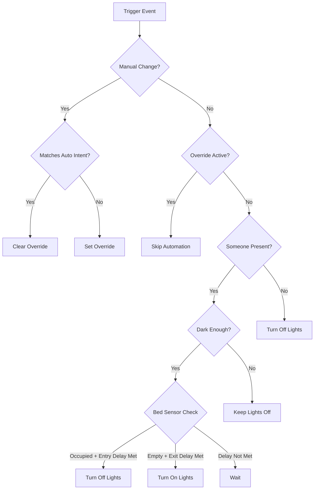

# Universal Smart Presence Lighting Control
### Enhanced Version 3.8.5 - The Only Light Automation Blueprint You'll Ever Need

[](https://www.home-assistant.io/docs/automation/using_blueprints/)
[]()
[]()

A sophisticated, universal lighting automation blueprint for Home Assistant that intelligently manages your lights based on presence, ambient light levels, and manual preferences. Works perfectly for **ANY** room type - bedrooms, offices, living rooms, kitchens, bathrooms, and more.

## 🌟 Key Features

### Core Functionality
- **🎯 Universal Design** - Single blueprint works for ALL room types
- **🔮 Smart Presence Detection** - Combines PIR, mmWave, and other occupancy sensors
- **💡 Intelligent Light Control** - Automatic on/off based on darkness and presence
- **🎨 Adaptive Brightness & Color** - Adjusts throughout the day for circadian rhythm
- **🔧 Manual Override Protection** - Respects your manual control decisions
- **⚡ Energy Efficient** - Automatically turns off when rooms are vacant
- **🛏️ Smart Bedroom Support** - Advanced bed sensor integration with delays (v3.8.5)

### Advanced Features (v3.8+)
- **🛏️ Smart Bed Delays** - Entry/exit delays prevent false triggers (v3.8.5)
- **🌅 Accurate Sunrise/Sunset** - Time-based calculation for all latitudes (v3.8.4)
- **📊 Smart Logging** - Conditional debug logs for better performance (v3.8.3)
- **☀️ Daytime Control** - Flexible options for daytime lighting behavior
- **👥 Guest Mode** - Special behavior for visitors
- **🔍 Performance Tracking** - Monitors automation efficiency
- **🌡️ Illuminance Averaging** - Filters out lighting spikes/drops

### Latest Updates (v3.8.5)
- **NEW** - Smart bed sensor delays with configurable entry/exit timing
- **NEW** - False trigger prevention when sitting on bed temporarily
- **ENHANCED** - Bed state tracking for intelligent delay management
- **IMPROVED** - More accurate presence-based control in bedrooms

## 📋 Table of Contents
- [Requirements](#-requirements)
- [Installation](#-installation)
- [Initial Setup](#-initial-setup)
- [Configuration Guide](#-configuration-guide)
- [How It Works](#-how-it-works)
- [Room-Specific Examples](#-room-specific-examples)
- [Troubleshooting](#-troubleshooting)
- [FAQ](#-faq)
- [Version History](#-version-history)

## 📦 Requirements

### Minimum Requirements
- Home Assistant 2024.1.0 or newer
- At least one motion/presence sensor
- At least one light or switch entity
- Basic understanding of Home Assistant automations

### Compatible Sensors
- ✅ Everything Presence One/Light sensors
- ✅ Standard PIR/motion sensors
- ✅ mmWave/radar presence sensors
- ✅ Any illuminance/light level sensor
- ✅ Bed occupancy sensors (optional)
- ✅ Phone/device trackers for home presence

### Compatible Lights/Switches
- ✅ Smart bulbs (Hue, LIFX, etc.)
- ✅ Smart switches (Z-Wave, Zigbee, WiFi)
- ✅ Smart dimmers
- ✅ Light groups
- ✅ Mixed setups (smart switch + smart bulbs)

## 🚀 Installation

### Method 1: Import via URL
1. Copy this URL:
   ```
   https://github.com/Chris971991/universal-smart-light-automation/blob/main/universal-smart-light-automation.yaml
   ```
2. In Home Assistant, go to **Settings** → **Automations & Scenes** → **Blueprints**
3. Click **Import Blueprint**
4. Paste the URL and click **Preview**
5. Click **Import Blueprint**

### Method 2: Manual Installation
1. Download `universal-smart-light-automation.yaml`
2. Copy to your Home Assistant config folder:
   ```
   /config/blueprints/automation/universal-smart-light/
   ```
3. Reload automations or restart Home Assistant
4. Blueprint will appear in your blueprints list

## 🛠️ Initial Setup

### Step 1: Create Required Helper Entities

You **MUST** create these helper entities before using the blueprint. Replace `[room_name]` with your room name in **lowercase** (e.g., `office`, `bedroom`, `living_room`).

#### Via UI (Recommended)
Go to **Settings** → **Devices & Services** → **Helpers** and create:

1. **Toggle Helpers** (Type: Toggle)
   - `input_boolean.[room_name]_automation_active`
   - `input_boolean.[room_name]_manual_override`
   - `input_boolean.[room_name]_light_auto_on`
   - `input_boolean.[room_name]_occupancy_state`

2. **Date/Time Helpers** (Type: Date and time)
   - `input_datetime.[room_name]_last_automation_action`
   - ⚠️ **MUST have both date AND time enabled**
   - `input_datetime.[room_name]_bed_state_changed` (ONLY if using bed sensor - v3.8.5)
   - ⚠️ **MUST have both date AND time enabled**

3. **Text Helper** (Type: Text)
   - `input_text.[room_name]_illuminance_history`
   - Set maximum length to 255

#### Via YAML
Add to your `configuration.yaml`:

```yaml
input_boolean:
  office_automation_active:
    name: Office Automation Active
  office_manual_override:
    name: Office Manual Override
  office_light_auto_on:
    name: Office Light Auto On
  office_occupancy_state:
    name: Office Occupancy State

input_datetime:
  office_last_automation_action:
    name: Office Last Automation Action
    has_date: true
    has_time: true
  # Only add if using bed sensor:
  bedroom_bed_state_changed:
    name: Bedroom Bed State Changed
    has_date: true
    has_time: true

input_text:
  office_illuminance_history:
    name: Office Illuminance History
    max: 255
```

### Step 2: Create the Automation

1. Go to **Settings** → **Automations & Scenes**
2. Click **Create Automation** → **Use Blueprint**
3. Select **Universal Smart Presence Lighting Control**
4. Configure according to your room needs (see Configuration Guide below)

## ⚙️ Configuration Guide

### Basic Configuration

#### Room Name
- **What it is**: Identifier for your room
- **Example**: `office`, `master_bedroom`, `living_room`
- **Important**: Use lowercase with underscores for multi-word names

#### Presence Sensors
- **PIR Motion Sensor**: Fast-reacting motion detection
- **Occupancy Sensor**: (Optional) Secondary sensor for stillness detection
- **Tip**: Can use same sensor for both if you only have one

#### Light/Switch Configuration
Choose your setup:
- **Smart Switch Only**: Controls regular bulbs
- **Smart Lights Only**: Direct bulb control (lamps, etc.)
- **Smart Switch + Smart Lights**: Switch acts as controller

#### Illuminance Thresholds
- **Dark Threshold**: Below this = needs lights (typically 20-50 lux)
- **Bright Threshold**: Above this = enough natural light (typically 150-300 lux)
- **Extremely Dark**: Pitch black conditions (typically 1-5 lux)

### Advanced Configuration

#### Smart Bed Sensor Delays (v3.8.5) 🆕
Prevents false triggers and improves bedroom automation reliability.

**Bed Entry Delay**:
- Time to wait after bed sensor detects occupancy before turning lights OFF
- Prevents lights turning off when you just sit on the bed temporarily
- Recommended: 30-60 seconds
- Example: Set to 30s - lights won't turn off if you're just sitting to put on shoes

**Bed Exit Delay**:
- Time to wait after bed sensor shows unoccupied before allowing lights to turn ON
- Prevents lights turning on when you roll over or briefly lose sensor contact
- Recommended: 15-30 seconds
- Example: Set to 15s - prevents false triggers from restless sleep

**Setup Requirements**:
1. Configure a bed sensor (binary_sensor or input_boolean)
2. Create the additional helper: `input_datetime.[room_name]_bed_state_changed`
3. Set appropriate entry/exit delays based on your needs
4. Enable "Turn Off Lights When Getting Into Bed" if desired

#### Daytime Control Mode
Prevents lights from turning on during daytime based on multiple options.

**Three Modes Available**:
- **Always Allow** - Normal operation, lights turn on automatically when dark and occupied
- **Block When Away** - Energy saving mode - prevents auto-on during daytime when nobody's home
- **Always Block** - Maximum energy saving - never auto-on during daytime regardless of presence

**Setup**:
1. Choose your preferred control mode
2. Add family phones/device trackers (required for "Block When Away")
3. Configure sunrise/sunset offsets for accurate daytime detection

**How it works**:
- Uses actual sunrise/sunset times (not sun elevation) for accuracy (v3.8.4)
- Respects your offset settings precisely (+30/-30 minutes, etc.)
- Works accurately at all latitudes, from equator to polar regions
- Manual control always works regardless of mode
- Automatic turn-OFF still works for energy saving

#### Guest Mode
Modified behavior for when you have visitors:
- Longer vacancy timeouts
- Extended override periods
- Less aggressive power saving
- Optional bed sensor bypass (useful for guest bedrooms)

#### Adaptive Lighting
**Brightness Control**:
- Automatically dims at night
- Brighter during day
- Adjusts based on ambient light

**Color Temperature**:
- Cool white (5000K) during day
- Warm white (3000K) at night
- Smooth transitions

#### Manual Override Behavior

**Two Modes Available**:

1. **Timeout Only** (Default)
   - Override lasts for set hours
   - Full manual control
   - Good for: Home theaters, offices

2. **Vacancy Can Clear**
   - Override clears after extended vacancy
   - Prevents forgotten overrides
   - Good for: Hallways, bathrooms

#### Debug Logging (v3.8.3)
**Smart Logging System**:
- Error logs are ALWAYS shown for critical issues
- Debug logs only appear when explicitly enabled
- Reduces log clutter in multi-room setups
- Better performance when not debugging

**To Enable Debug Logs**:
1. Toggle "Enable Debug Logs" in automation configuration
2. View logs: **Settings** → **System** → **Logs**
3. Filter by your room name

#### Automatic Update Notifications (Optional)

Get notified when new blueprint versions are available!

**Step 1:** Add this sensor to your configuration.yaml file:

```yaml
sensor:
  - platform: rest
    name: "Universal Lighting Updates"
    resource: https://api.github.com/repos/Chris971991/universal-smart-light-automation/releases/latest
    value_template: >
      {{ value_json.tag_name | default('unknown') }}
    scan_interval: 86400
```

**Step 2:** Restart Home Assistant

**Step 3:** Enable the "Check for Updates" option at the bottom of the automation configuration

## 🔄 How It Works

### Decision Flow



### Smart Bed Sensor Logic (v3.8.5)

The automation intelligently manages bed-related lighting with configurable delays:

1. **Getting Into Bed**:
   - Bed sensor detects occupancy
   - Waits for entry delay (prevents false triggers from sitting)
   - If still occupied after delay → turns lights OFF
   - If unoccupied before delay expires → cancels action

2. **Getting Out of Bed**:
   - Bed sensor detects vacancy
   - Waits for exit delay (prevents false triggers from movement)
   - If still empty after delay → allows lights to turn ON
   - If reoccupied before delay expires → maintains OFF state

3. **Benefits**:
   - No more lights turning off when sitting on bed edge
   - No more lights flashing on during restless sleep
   - Smooth, predictable behavior for bedtime routines

### Manual Override Logic

The automation intelligently manages manual overrides:

1. **Override SET when**:
   - You turn lights ON when it's bright
   - You turn lights OFF when it's dark and you're present
   - Your action conflicts with automation intent

2. **Override CLEARED when**:
   - You turn lights ON when dark (matches automation)
   - You turn lights OFF when leaving (matches automation)
   - You turn lights OFF in bright room
   - Timeout expires
   - Extended vacancy (if enabled)

3. **Override RESPECTED**:
   - Automation won't change lights while override active
   - Manual control takes priority

### Triggers

The automation responds to:
- Motion/presence sensor changes
- Illuminance sensor changes
- Manual light/switch control
- Sun position changes (sunrise/sunset)
- Bed sensor state changes (with delay processing)
- Periodic checks (every minute for monitoring)

## 🏠 Room-Specific Examples

### Bedroom Configuration (with Smart Delays)
```yaml
Room Name: master_bedroom
Dark Threshold: 20 lux
Bright Threshold: 150 lux
Bed Sensor: binary_sensor.bed_occupancy
Bed Entry Delay: 45 seconds
Bed Exit Delay: 20 seconds
Turn Off When Bed Occupied: Enabled
Vacancy Timeout Multiplier: 3
Guest Mode: Available for visitors
```

### Office Configuration
```yaml
Room Name: office
Dark Threshold: 30 lux
Bright Threshold: 200 lux
Vacancy Timeout Multiplier: 5
Override Behavior: Timeout Only
Override Timeout: 4 hours
Daytime Control: Always Allow
Debug Logs: Disabled
```

### Living Room Configuration
```yaml
Room Name: living_room
Dark Threshold: 40 lux
Bright Threshold: 250 lux
Adaptive Brightness: Enabled
Color Temperature Control: Enabled
Guest Mode: Enabled for parties
Daytime Control: Block When Away
Sunrise Offset: +30 minutes
Sunset Offset: -30 minutes
```

### Bathroom Configuration
```yaml
Room Name: bathroom
Dark Threshold: 50 lux
Bright Threshold: 300 lux
Vacancy Timeout Multiplier: 2
Override Behavior: Vacancy Can Clear
Fade On/Off: Disabled (instant)
```

## 🔧 Troubleshooting

### Common Issues

#### Lights Not Turning On
1. **Check helpers exist** - All required helpers must be created
2. **Check bed delays** - If in bedroom, ensure exit delay has elapsed
3. **Check threshold** - Is room actually dark enough?
4. **Check override** - Is manual override active?
5. **Check presence** - Is sensor detecting you?
6. **Check daytime mode** - Is it blocked during daytime hours?

#### Bedroom Lights Turn Off Too Quickly
1. **Increase bed entry delay** - Try 60+ seconds
2. **Check sensor placement** - Ensure reliable detection
3. **Enable guest mode** - Temporarily disables bed features

#### Bedroom Lights Flash On at Night
1. **Increase bed exit delay** - Try 30+ seconds
2. **Check sensor stability** - May need adjustment
3. **Verify sensor type** - Some sensors are too sensitive

#### Lights Not Turning Off
1. **Check presence** - Sensor still detecting movement?
2. **Check timeout** - Multiplier might be too high
3. **Check override** - Manual override preventing off?
4. **Check bed delays** - May be waiting for delay to expire

#### Override Not Clearing
1. **Verify helpers** - Ensure boolean helpers working
2. **Check timeout** - Has enough time passed?
3. **Check presence respect** - Still in room?

### Debug Mode

Enable debug logging to see detailed decision making:

1. Enable "Debug Logs" in automation config
2. View logs: **Settings** → **System** → **Logs**
3. Filter by your room name

Example debug output (v3.8.5):
```
[BEDROOM] AUTOMATION START
│ Trigger: bed_change
│ Lights On: YES
│ Room Presence: YES
│ Bed: OCCUPIED (delay: 35s/30s)
│ Bed Allows Lights: NO (waiting)
│ Should: turn OFF
```

## ❓ FAQ

**Q: Do I need the bed_state_changed helper for non-bedroom rooms?**
A: No, this helper is ONLY required if you're using a bed sensor. Skip it for other rooms.

**Q: Why do I need bed delays?**
A: They prevent false triggers. Without delays, lights might turn off when you sit on the bed or flash on when you move during sleep.

**Q: What's the difference between entry and exit delays?**
A: Entry delay = time before lights turn OFF when getting into bed. Exit delay = time before lights can turn ON when getting out of bed.

**Q: Can I use this for multiple rooms?**
A: Yes! Create separate automations for each room using the same blueprint.

**Q: What if I don't have a light sensor?**
A: Create an `input_number` helper set to 50 lux as a placeholder.

**Q: Will this work with light groups?**
A: Yes! Select your light group as the light entity.

**Q: Why aren't sunrise/sunset offsets working correctly?**
A: v3.8.4 fixed this! The automation now uses actual time calculations instead of sun elevation for accurate offsets at all latitudes.

**Q: How do I reduce log spam from multiple rooms?**
A: v3.8.3 introduced smart logging - debug logs only show when explicitly enabled per room, while errors always appear.

**Q: Can I disable the automation temporarily?**
A: Yes, disable the automation entity or use Guest Mode for modified behavior.

## 📝 Version History

### v3.8.5 (Current)
- **Added**: Smart bed sensor delays (entry/exit)
- **Added**: Bed state tracking helper
- **Fixed**: False triggers from temporary bed occupancy
- **Enhanced**: Bedroom automation reliability

### v3.8.4
- **Fixed**: Sunrise/sunset offset calculations
- **Improved**: Time-based calculation for all latitudes
- **Enhanced**: Daytime detection accuracy

### v3.8.3
- **Added**: Smart conditional logging
- **Improved**: Multi-room performance
- **Fixed**: Log spam issues

### v3.8.2
- **Combined**: Unified daytime control modes
- **Simplified**: Configuration options

### v3.8.1
- **Fixed**: Boolean logic in manual override system
- **Fixed**: String/boolean type confusion

### v3.8.0
- **Added**: Away Mode with phone tracking
- **Added**: Daytime control options
- **Enhanced**: Bedroom support

### Previous Versions
- v3.7: Illuminance spike protection
- v3.6: Guest mode
- v3.5: Adaptive lighting
- v3.0: Universal design
- v2.0: Basic bed sensor support
- v1.0: Initial release

## 🤝 Contributing

Contributions are welcome! Please:
1. Fork the repository
2. Create a feature branch
3. Test thoroughly
4. Submit a pull request

## 📄 License

MIT License - See LICENSE file for details

## 🙏 Acknowledgments

- Home Assistant community for testing and feedback
- Everything Presence One for excellent sensor integration
- Contributors and bug reporters

## 📧 Support

- **Issues**: [GitHub Issues](https://github.com/Chris971991/universal-smart-light-automation/issues)
- **Discussions**: [Home Assistant Community](https://community.home-assistant.io/)
- **Documentation**: [Wiki](https://github.com/Chris971991/universal-smart-light-automation/wiki)

---

**Made with ❤️ for the Home Assistant Community**